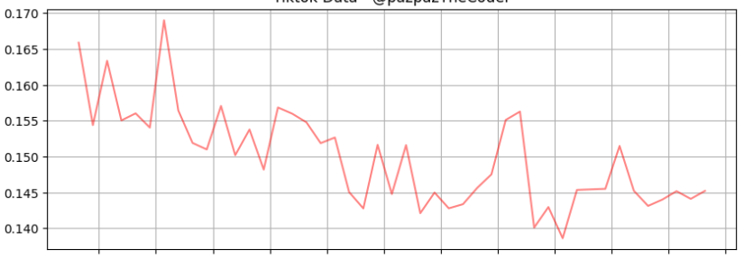
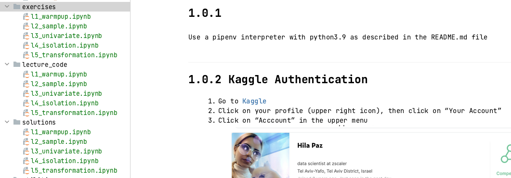
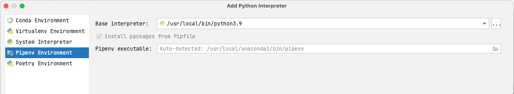

</a>

## Preprocessing with SUIT Method
Lecture 2, November 9th, 2022

</a>

## Contents
<!-- TOC -->
* [1. Meta Structure](#0-meta-structure)
* [2. Access Materials](#2-access-materials)
* [3. Setup](#3-setup)
  * [3.1 Clone your repository](#31-clone-your-repository)
  * [3.1 Pipenv](#31-pipenv)
  * [3.2 Interpreter](#32-interpreter)
<!-- TOC -->

# 1. Meta Structure
This git repository is accompanying DataNights Time Series Course, [Lecture 2 - Preprocessing]().
it is highly recommended to watch the lecture before you jump into the code!

The lecture meta structure consists 5 micro-lectures.
Each of these contain
* Theory
* Live Coding
* Exercise
* Closure and Cheat-Sheet

Each lecture has a link to YouTube, corresponding lecture code, exercise notebook and a solution.

</a>

# 2. Access Materials
[YouTube: Lecture 2 - Preprocessing]()
Cheat-Sheet and Lectures PDF can be found in "lectures_pdf" folder

# 3. Setup
This is how you should set up your work environment:

### 3.1 Clone your repository 
with your preferable way.

### 3.1 Pipenv
Set the virtual environment to be pipenv with py39

</a>

If dependency installation does not happen manually, run a shell command 

> `pipenv sync`

## 3.2 Interpreter
I recommend *DataSpell* to work with notebooks.

The second-best option is to access the notebooks through
> `pipenv run jupyter notebook`

The last option is to use Google Collab, but in addition to cloning the repo, 
you will need to run:

> ! pip install pipenv
>
> ! git clone https://github.com/hip023/suit.git
> 
> ! pipenv sync
>

</a>

